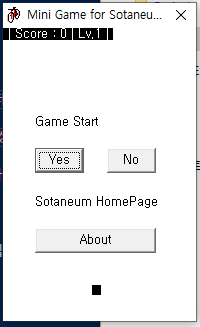
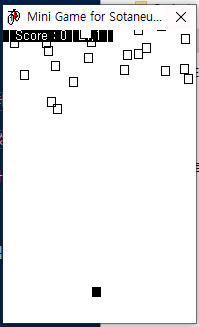
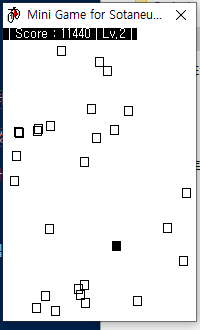
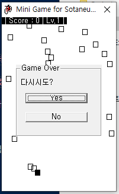

# minigame Avoid boxes

박스 피하기 게임 : 미니 게임

## Download

- [`Windows x86 zip file`](./build/Avoid_boxes_x86_0.0.1.zip?raw=true)

## Info

- 싱글 플레이 전용
- 조작키
  - 상하좌우 : WSAD
- 스토리
  - 다른 사람들과 근처도 가기 싫을 정도로 더운날 길을 걷는 당신에게 수 많은 사람들이 오고 있다면 어떻게 하시겠습니까?
  - 당신을 가리키는 검은색 박스가 수 많은 사람 속에서 최대한 피해다닐 수 있도록 도와주세요.
- 내려오는 박스를 피하여 `점수`를 획득하세요.

    

- 각 박스마다 내려오는 속도가 다릅니다.

    

- 특징
  - 레벨이 높아질 수록 빠른 박스들이 나옵니다.
  - 다른 박스와 충돌하면 게임 오버입니다.

    

## What did you learn

- `비주얼 베이직`으로 구현한 게임입니다. `비주얼 베이직`에서 `충돌 처리`를 하는 것이 어렵다는 것을 깨달았습니다.
- 비록 게임의 프레임은 많이 떨어지지만 `게임을 구현할 수 있다는 가능성`을 보았습니다.
- 각 박스의 정보를 동적으로 생성하는 방법에 대해 공부할 수 있었습니다.

## Finally

- 여러 미니게임을 만들고자 했던 하나의 목표로 구현된 `Avoid boxes`입니다.
- 미니게임 시리즈로 [`총 박스 게임`](https://github.com/Sotaneum/minigame-gun-box)와 [`리듬게임`](https://github.com/Sotaneum/minigame-Rhythmic-game)도 있습니다.

## Modify Content

- 2012.12.25
  - 게임 개발

## Copyright

- 비상업적 용도로 사용 가능하며 링크를 반드시 포함해주세요.
- 문제가 되는 내용이 있다면 언제든지 [`issue`](https://github.com/Sotaneum/minigame-Avoid-boxes/issues/new), [`Pull requests`](https://github.com/Sotaneum/minigame-Avoid-boxes/compare) 부탁드립니다.